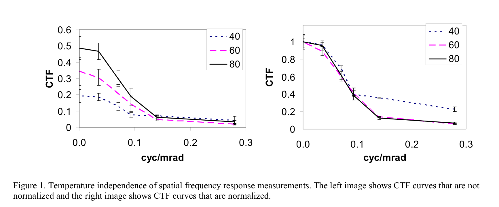
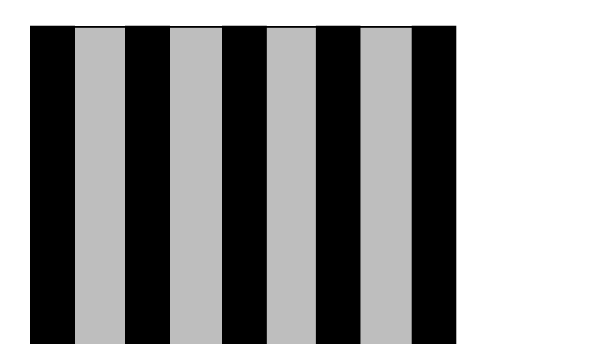
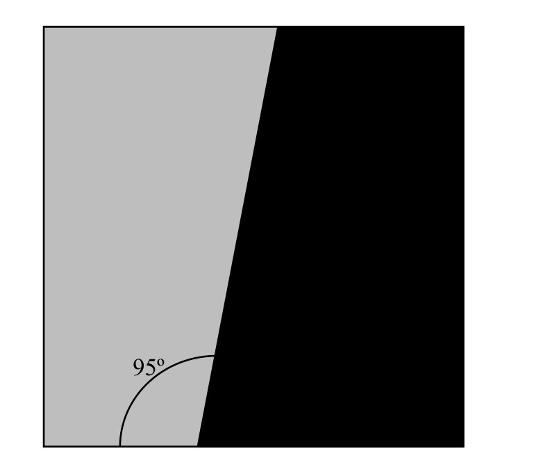
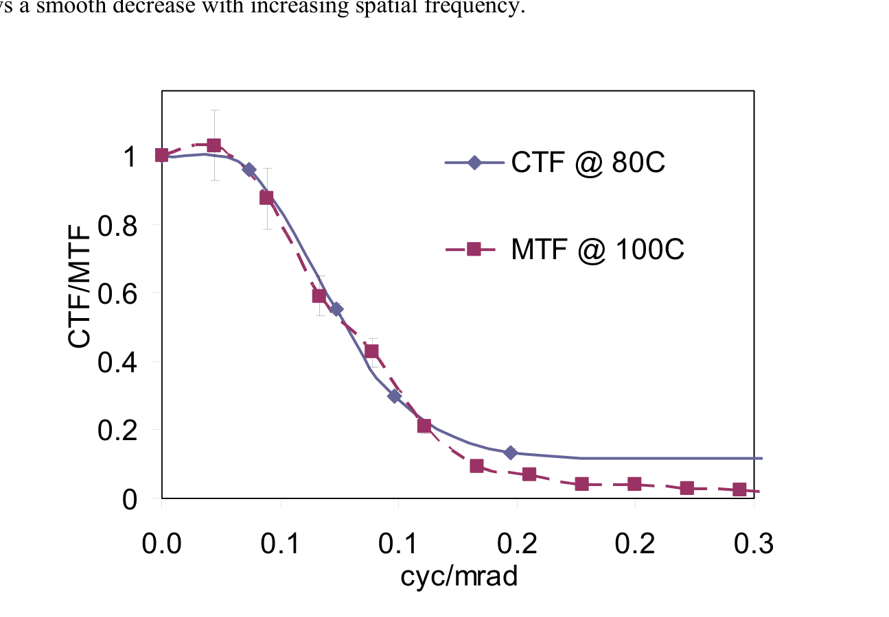
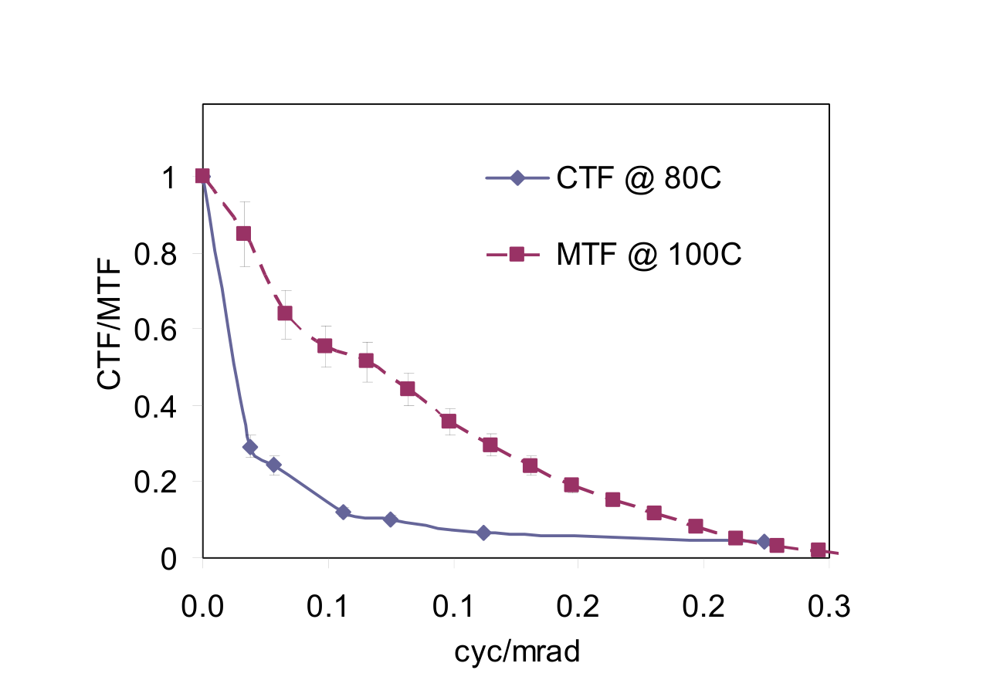
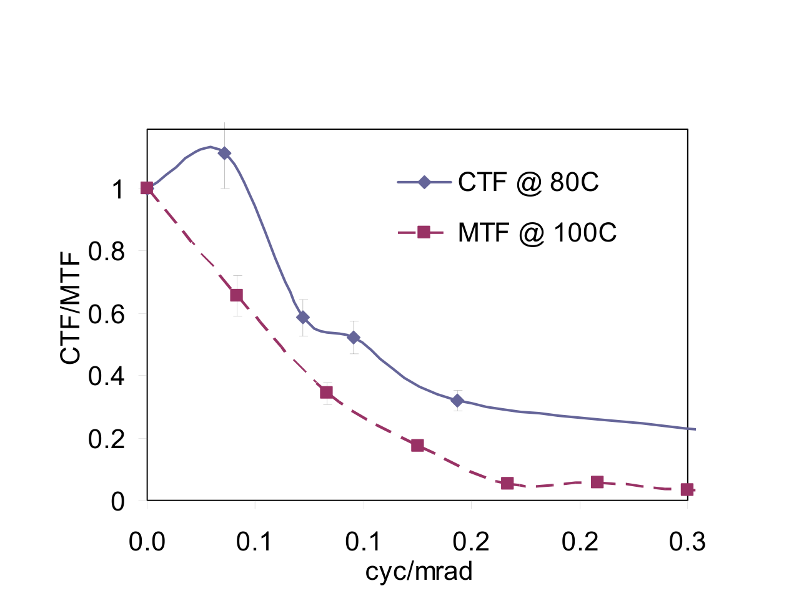
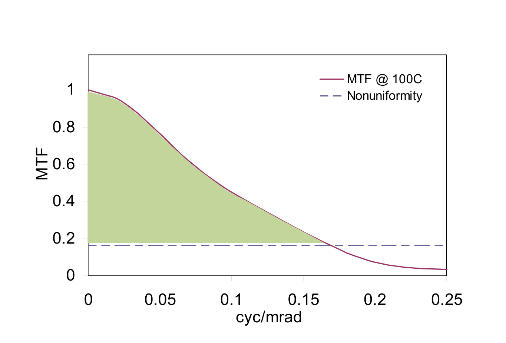

# 以空間頻率響應作為熱像儀性能評估準則之應用

**原文：** Andrew Lock* and Francine Amon, *Application of spatial frequency response as a criterion for evaluating thermal imaging camera performance*, Proc. of SPIE Vol. 6941, 69411C (2008). doi: [10.1117/12.779158](https://doi.org/10.1117/12.779158)

**作者單位：** 美國國家標準與技術研究院（National Institute of Standards and Technology, NIST），100 Bureau Drive, Gaithersburg, MD 20899

**通訊作者：** andrew.lock@nist.gov，（301）975-8794

**譯文說明：** 本文件為上述 2008 年 SPIE 論文之繁體中文全譯。術語首次出現時附原文；圖表取自原文，圖說另譯。NIST 公務人員職務作品於美國屬公有領域。原文刊於 *Infrared Imaging Systems: Design, Analysis, Modeling, and Testing XIX*，Gerald C. Holst 編。

---

## 摘要

警察、消防人員與緊急醫療人員等第一線應變人員，每天都以非常實際的方式使用熱像儀。然而，目前幾乎沒有可用的性能指標，能協助第一線應變人員評估熱成像技術的表現。本文描述一種可能的空間解析度評估指標：將空間頻率響應（Spatial Frequency Response, SFR）計算應用於熱成像。

依 ISO 12233 之定義，SFR 為調變傳遞函數（Modulation Transfer Function, MTF）曲線下方的積分面積；該 MTF 曲線係由相機拍攝刀口靶（knife-edge target）影像後，對其做離散傅立葉變換而得。本文對此概念稍作修改，作為相機性能的定量分析：改為積分 **MTF 曲線與相機特徵非均勻性（nonuniformity，亦即在室溫下測得的噪聲底限）之間的面積**。所得數值稱為**有效 SFR**（Effective SFR），可再與針對特定任務之人眼感知測試所得的空間解析度相比，據以判斷熱像儀性能是否可被接受。本文所述測試程序，正作為一套測試方法的一部分加以發展，以期納入第一線應變人員用熱像儀之性能標準。

**關鍵詞：** 空間頻率響應、熱像儀、消防、第一線應變人員、評估、性能、調變傳遞函數、對比傳遞函數

---

## 1. 緒論

熱像儀（thermal imaging camera, TIC）正成為許多消防人員及其他第一線應變人員的重要工具。近年來技術與製造的進展，已使熱像儀價格低到大多數消防單位都能採購，因此在全美的使用也更加普及。然而，由於缺乏熱像儀性能標準，使用者面對的產品設計與能力差異很大，且所宣稱的性能幾乎沒有一致性。因此，美國國家消防協會（National Fire Protection Association, NFPA）正在制定新的性能標準 NFPA 1801 [1]，規範消防用熱像儀，以確保這些工具具備火災應用所需的品質與能力。為支持此目標，美國國家標準與技術研究院（NIST）持續研究熱像儀性能，並特別強調影像品質。

目前已確立的偵測器／感測器技術主要有三種：鈦酸鍶鋇（barium-strontium-titanate, BST）、氧化釩（vanadium oxide, VOx）與非晶矽（amorphous silicon, ASi）。消防應用所使用的熱偵測器為非製冷焦平面陣列（uncooled focal plane array, FPA），即在光學系統焦平面上配置感測器陣列；各種偵測器技術所能在顯示影像中產生的資訊量略有不同。典型的 FPA 感測器組態有兩種：240 列 × 320 行（例如本文討論的 BST 熱像儀），以及 120 列 × 160 行（例如本文討論的 VOx 與 ASi 熱像儀）。對 VOx 與 ASi 熱像儀而言，當入射紅外輻射強到使偵測器陣列中預定比例的像素飽和時，偵測器的積分（曝光）時間會自動縮短。此機制稱為**模式切換**（mode shift），會降低偵測器的熱靈敏度，但能偵測更大範圍的表面溫度。須注意：模式切換不適用於 BST 偵測器。

熱像儀的外形、目標市場價格各異，光學與電子封裝的設計方式同樣繁多。本研究討論的測試方法，以及為 NFPA 標準所發展的其他測試方法，都把熱像儀視為「黑箱」（black box），不單獨考量各個元件的性能。首要關注的是熱像儀作為**完整系統**的整體表現。

本文提出一種評估消防用熱像儀空間頻率響應（SFR）的方法。SFR 表示特定熱像儀分辨空間細節的能力。此量與偵測器陣列的像素解析度有關，但光學與影像處理等因素也會影響給定熱像儀的 SFR。本文發展並比較了數種量測熱像儀 SFR 的指標。首先考慮熱像儀觀看一組條紋頻率逐漸升高的條狀靶時的對比傳遞函數（contrast transfer function, CTF），再考慮任意形狀（例如線或邊緣）的調變傳遞函數（MTF）。兩種作法都會在此討論，並給出對應結果。結果顯示，以 MTF 決定 SFR 更為有效，也更容易實施。文中亦舉例說明此量測如何納入 NFPA 標準。

---

## 2. 方法

由於所考慮的相機是熱像儀，用來評估 SFR 的靶必須是熱靶，且溫度須能代表真實環境。根據 Donnelly 等人的研究，已為消防用熱像儀制定溫度等級。熱等級為：第 I 級，30 °C–100 °C；第 II 級，100 °C–160 °C；第 III 級，160 °C–260 °C [2]。空間頻率評估在各溫度等級皆已完成；只要對比足以進行量測，結果與溫度無關，後文將說明。若要比較數台熱像儀，必須在相同熱靶條件下評估所有熱像儀，以免因模式切換而改變熱像儀靈敏度。CTF 與 MTF 都是相對量測，會以零頻率情況正規化，以消除溫度影響。各類 SFR 計算皆規定靶的最小對比為 20%。本次評估選用標稱靶溫 100 °C，對比背景為 30 °C。

CTF 表示場景中所觀察到的最大對比；在某一頻率下 CTF 越高，表示該熱像儀分辨該條紋頻率的能力，優於 CTF 較低的條紋頻率。CTF 量測時拍攝一系列條狀靶。每個靶由圓管組成，管間距等於管寬。管子上下以歧管連接，並以恆溫加熱流體（本實驗為矽油）泵送通過管子，以達到均勻的靶溫。加熱後的條狀靶再置於大面積黑體（邊長 17.8 cm 的正方形）前方。條狀靶溫度設為給定靶溫，並改變黑體溫度以得到不同對比。一旦條狀靶與背景之間有足夠對比，各頻率靶即維持此溫度。頻率更高的條狀靶依序置於黑體前方，並對每個靶做 CTF 量測。隨著靶條空間頻率升高，各熱像儀的 CTF 值下降，表示熱像儀分辨較高條紋頻率的能力降低。

CTF 函數量測影像既定區域內對比的變化。CTF 可理解為像素強度的最大差值，除以像素強度可能的最大差值，關係為：

$$
\mathrm{CTF} = \frac{I_{\max} - I_{\min}}{(\Delta I)_{\max}} \tag{1}
$$

其中 \(I_{\max}\) 與 \(I_{\min}\) 分別為最大與最小像素強度，\((\Delta I)_{\max}\) 表示像素強度可能的最大差值。\((\Delta I)_{\max}\) 可取為當前場景中的最大與最小差值，或取為影像位元深度所對應的全部灰階數。本文將 \((\Delta I)_{\max}\) 取為所考慮影像的位元深度（8 bit = 256 個灰階層）。

*圖 1. 空間頻率響應量測與溫度無關。左圖為未經正規化的 CTF 曲線，右圖為經正規化的 CTF 曲線。*

依序評估更高頻率，直到相鄰靶的 CTF 不再變化。然後將 CTF 值對零頻率 CTF 值正規化，並對頻率作圖。圖 1 顯示一台 ASi 相機在不同靶溫下的 CTF 響應：左圖未經正規化，右圖已對零頻率正規化。若不正規化，不同靶溫會出現明顯不同的 CTF 曲線，會**錯誤地**顯示相機的 SFR 是溫度的函數。然而，由於 CTF 與 MTF 都是相對量測，必須加以正規化。一旦完成正規化（見圖 1 右），不同溫度的 CTF 曲線會重合，在不確定度範圍內沒有差異。圖 1 中的例外是 40 °C 的 CTF 量測。此溫度另有一個問題：影像對比不足，無法做適當量測。將 CTF 曲線下方面積積分，再減去非均勻性（亦即噪聲底限），所得即為熱像儀的有效 SFR。

至於 MTF，許多任意形狀都曾（而且已經）被用作靶，以導出 SFR。對可見光相機，MTF 常直接由類似 CTF 所用方波的正弦波圖案量得。這類靶對熱像儀很難製作，尤其因為正弦波變化必須是溫度變化，且峰谷之間要有足夠對比。另一作法是對熱靶所記錄影像中的點、線或邊緣等形狀做傅立葉變換 [3]。傅立葉變換回傳的各頻率振幅，即為該頻率的響應。與 CTF 類似，傅立葉振幅會對響應的零頻率值正規化，因而與靶溫無關。所得曲線即為熱像儀的 MTF 函數。要得到有效 SFR，同樣將曲線下方面積積分，再減去噪聲底限。邊緣靶與線靶其實是同一種靶，因為邊緣靶可經微分在數學上轉成線靶。本實驗選用邊緣靶，因為它在其他影像處理領域很常用 [4]，而且實施簡單。靶的製備使邊緣相對水平約成 **95 度**角。此斜邊可克服熱像儀感測器的混疊（aliasing）效應，使邊緣被過取樣四倍 [4]。

### 2.1 實驗配置

CTF 量測使用六種不同熱靶。靶以標準尺寸銅管製作。所用管徑為 19 mm、12.7 mm、9.5 mm、6.4 mm、3.2 mm 與 1.6 mm。每個靶的管間距等於管徑。管子再塗以特性已知、熱發射性良好的 Medtherm† 塗料，發射率 \(\varepsilon = 0.94\)。加熱流體採用甲基二甲基矽氧烷油（Methyl Di-Methyl Siloxane oil），用以設定條溫。加熱後的管子置於大面積黑體前方，如圖 2 所示。管子與黑體的溫度差須足夠大，使熱像儀能觀察到該溫差。熱像儀置於距靶 **1 m** 處，使條紋對焦，並達到所需空間頻率（單位為週期／毫弧度，cyc/mrad）。然後對每個頻率靶記錄數秒熱像儀輸出。影像數位化後，對靶區內每一影像列以式 (1) 分析、平均，再回報平均 CTF 值。所有靶分析完畢後，將 CTF 值對零頻率靶正規化。

† 本文提及若干公司與商業產品，僅為充分說明資訊或所用設備來源。此類標示不代表美國國家標準與技術研究院背書或推薦，亦不表示該來源或設備為該用途之最佳選擇。

MTF 靶量測只需一個靶。斜邊同樣塗以 \(\varepsilon = 0.94\) 的熱發射塗料，置於大面積黑體前方，如圖 3 所示。斜邊不加熱，維持室溫（約 20 °C）。黑體溫度升高，使熱像儀能清楚觀察溫差。各熱像儀置於距靶 1 m 處。熱像儀輸出約記錄 10 秒。影像數位化後，以 Slant Edge Analysis Tool **sfrmat 2.0** [5] 分析靶區內每一影格。影像的 MTF 曲線依文獻 [4] 自動計算並回報。MTF 曲線同樣對零頻率正規化。

*圖 2. CTF 量測熱靶配置示意圖。影像對比來自溫度差，因兩元件發射率相同。*

*圖 3. MTF 量測配置示意圖。影像對比來自溫度差，因兩元件發射率相同。*

---

## 3. 結果與討論

### 3.1 CTF 與 MTF 之比較

圖 4–6 比較具 BST、VOx 與 ASi 偵測器之熱像儀，在數個不同溫度下的 CTF 與 MTF 量測。各圖以誤差棒表示不確定度，包含因子 \(k = 2\)。CTF 與 MTF 曲線有顯著差異。

BST 熱像儀曲線見圖 4。對 BST 相機而言，CTF 與 MTF 曲線非常相似，表示不論用 CTF 或 MTF 計算 SFR，都可能得到相同結果。本文所考慮的 BST 熱像儀，偵測器像素數為 VOx 或 ASi 熱像儀的四倍。與 CTF 計算相比，MTF 計算的不確定度較大。這可能與較高像素解析度有關：相較於 VOx 與 ASi 熱像儀，較多像素落在靶上，使低頻率量測可重複性高得多。VOx 與 ASi 熱像儀（分別見圖 5 與圖 6）則未觀察到如此接近的 CTF／MTF 一致性。

圖 5 的 VOx 熱像儀顯示 CTF 與 MTF 曲線差異極大，CTF 曲線遠低於 MTF 曲線。此一觀察的一個含義是：本量測所用的低頻率靶，在零頻率靶之前，**可能還不夠低頻**。

事實上，要準確捕捉熱像儀空間頻率響應所需的靶數量與頻率，會高度依賴該熱像儀的像素解析度與光學特性。這增加了實體 CTF 量測的複雜度：需要更多靶，且須反覆嘗試才能決定正確的量測範圍。MTF 靶沒有此缺點，僅用單一零頻率靶即可決定響應。

圖 6 的 ASi 熱像儀呈現相反的相對關係：CTF 曲線高於 MTF 曲線。具體而言，本文所考慮的 ASi 熱像儀，因非線性訊號響應與實體光學缺陷，容易出現顯著寬頻噪聲與訊號非均勻性。由於 CTF 值的計算方式，較大的空間噪聲可能使計算回報更大的對比。這顯示 CTF 計算的一個特定缺陷，而 MTF 計算沒有此問題。對 VOx 與 ASi 熱像儀，CTF 量測相對於 MTF 量測都回報較大不確定度。這是各熱像儀在 CTF 量測中所遭遇個別問題的結果。這些根本問題造成的不確定度，並不取決於所考慮的靶。

若可將 MTF 視為熱像儀頻率響應較正確的表述，則 CTF 量測的其他問題也會顯露出來。在圖 4–6 中，CTF 曲線曾出現在 MTF 曲線之上、之下，以及非常接近之處，表示 CTF 量測在熱像儀與熱像儀之間並不一致。此外，CTF 的趨勢往往遠不如 MTF 曲線平滑。以圖 6 的 ASi 熱像儀結果為例：ASi 的 CTF 從零頻率開始上升，這是由於量測不確定度，也可能是像素間距與靶頻率之間諧波關係的人為產物。依 SFR 之定義，零頻率 CTF 值應為 1，所有更高頻率應介於 0 與 1 之間。圖 6 的 ASi 熱像儀在接近噪聲底限之前，還有額外的拐點。另一方面，ASi 的 MTF 則隨空間頻率升高而平滑下降。

*圖 4. BST 熱像儀之 CTF 與 MTF 比較。CTF 量測使用 80 °C 黑體與 30 °C 條狀靶。MTF 量測使用 100 °C 黑體與室溫（約 20 °C）斜邊靶。不確定度由統計決定，以包含因子 \(k = 2\) 表示。*

*圖 5. VOx 熱像儀之 CTF 與 MTF 比較。CTF 量測使用 80 °C 黑體與 30 °C 條狀靶。MTF 量測使用 100 °C 黑體與室溫（約 20 °C）斜邊靶。不確定度由統計決定，以包含因子 \(k = 2\) 表示。*

*圖 6. ASi 熱像儀之 CTF 與 MTF 比較。CTF 量測使用 80 °C 黑體與 30 °C 條狀靶。MTF 量測使用 100 °C 黑體與室溫（約 20 °C）斜邊靶。不確定度由統計決定，以包含因子 \(k = 2\) 表示。*

空間解析度量測還應考慮量測是否容易進行。如上所述，CTF 量測需要大量設備，以及數個複雜的客製靶。更換不同靶、等待各靶達到目標溫度，既費工又耗時。此外還有靶與熱像儀像素對齊的問題。若 CTF 靶幾乎與熱像儀像素平行，會形成莫爾條紋（Moiré patterns），產生虛假對比而干擾 CTF 量測。若靶角度選得不好，也可能發生靶的混疊。MTF 量測以靶放在 **5 度**角、且只需成像單一邊緣，避免了此問題。5 度角也使邊緣被過取樣四倍，從而更準確地表示梯度與所得頻率響應。MTF 量測所需設備也較少：只需一個大面積黑體與一次邊緣靶量測。然後只需對 MTF 靶做一次量測即可取得所需資料。MTF 量測方法的計算量大於 CTF 量測；然而，運算很容易自動化，且已有成品工具可商用 [5]。

根據這些觀察，以及對 CTF 與 MTF 量測的嚴謹比較，判定在此熱成像應用中，**MTF 可能是決定空間頻率的較佳方法**。實驗配置簡化、量測也更容易，使 MTF 量測更為可取。

### 3.2 有效空間頻率響應之決定

這些量測的優值（figure of merit）是 **MTF 曲線與熱像儀非均勻性底限之間的面積**。此處將計算並討論圖 4–6 三台熱像儀的有效 SFR。MTF 曲線依上文決定，非均勻性底限則依據文獻 [6] 所述程序。圖 7 示意地將 MTF 曲線與非均勻性疊加，並標出代表有效 SFR 的區域。非均勻性底限之所以重要，是因為用來決定 MTF 曲線的傅立葉變換方法並未考慮噪聲底限，會回報遠超過此自然截止點的頻率。

*圖 7. 如何依 MTF 曲線與非均勻性底限計算有效 SFR 的示意。積分 MTF 與非均勻性之間的面積以求得 SFR。*

BST、VOx 與 ASi 熱像儀的有效 SFR 分別為 **0.066、0.025 與 0.021**。若不把非均勻性納入這些計算，BST、VOx 與 ASi 熱像儀的 SFR 值會分別為 **0.088、0.083 與 0.085**。比較此處 VOx 與 ASi 相機的結果，即可看出噪聲底限的重要性。若純以未經修正的 SFR 值來看，這台 ASi 相機的 SFR 大於這台 VOx 相機。然而納入非均勻性後，關係反轉，這台 VOx 的有效 SFR 大於這台 ASi。這些差異可能影響採購決策，以及認證與法規標準符合性。

### 3.3 SFR 的通過／不通過準則

如上所述，SFR 是測試機構對熱像儀進行的量測，該機構可能據以認證熱像儀性能符合 NFPA 標準。標準中的通過／不通過準則，將由即將在美國陸軍夜視實驗室（US Army Night Vision Laboratory, NVL）進行的人眼感知測試決定。受試者將是使用熱像儀之消防人員的代表性樣本，他們會被要求在一序列經特定方式劣化的熱影像中辨識火災危害。其中部分影像的空間解析度被劣化，使受試者辨識火災危害的表現可對空間解析度作圖。這些資料將提供給 NFPA 委員會考量，並據以發展指標，以決定成功完成辨識任務的可接受機率。資料可用來決定對應的空間解析度，該解析度隨後可成為標準中空間解析度通過／不通過準則的一部分。

---

## 4. 結論

本文提出消防用熱像儀（TIC）空間頻率響應（SFR）的量測方法。文中提出並比較兩種 SFR 量測技術：對比傳遞函數（CTF）與調變傳遞函數（MTF）。CTF 顯示為容易理解的量測，幾乎不需數學處理，但此測試的實驗程序昂貴且耗時。MTF 顯示為分析上數學強度高得多的測試；然而實驗配置遠比 CTF 量測更簡單、便宜、快速。此外，MTF 量測比 CTF 量測產生更符合實際、可重複性更高的結果。MTF 量測的數學嚴謹性，很容易以產業標準工具克服，因此可能更適合作為、也更實用的 SFR 量測方法。

在決定 SFR 時納入非均勻性的重要性不可忽視。若不考慮非均勻性，不同熱像儀的相對性能可能顯著改變，甚至反轉。一旦得知（含非均勻性的）SFR，即可與性能標準（例如 NFPA 1801）所規定、為達到足夠性能所必需的最低 SFR 相比。

---

## 參考文獻

[1] NFPA, "Standard on Thermal Imagers for the Fire Service." NFPA 1801, (NFPA 1801), (2008).

[2] Donnelly, M. K.; Davis, W. D.; Lawson, J. R.; Selepak, M. S., "Thermal Environment for Electronic Equipment used by First Responders." (NIST Technical Note 1474), (2006).

[3] Holst, G. C., *Testing and Evaluation of Infrared Imaging Systems*. JCD Publishing: Winter Park, FL, (1998).

[4] ISO, "Photography — Electronic still-picture cameras — Resolution measurements." ISO 12233, (2000).

[5] I3A, http://www.i3a.org/downloads_iso_tools.html in: International Imaging Industry Association: 2000.

[6] Lock, A.; Amon, F. "Practical Measurement and Analysis of the Nonuniformity of Thermal Imaging Cameras for First Responders", SPIE Defense + Security, Orlando, FL, 2008; SPIE: Orlando, FL, 2008.

---

## 術語對照

| 原文 | 本文譯名 |
| --- | --- |
| Spatial Frequency Response (SFR) | 空間頻率響應 |
| Effective SFR | 有效空間頻率響應 |
| Modulation Transfer Function (MTF) | 調變傳遞函數 |
| Contrast Transfer Function (CTF) | 對比傳遞函數 |
| Thermal Imaging Camera (TIC) | 熱像儀 |
| knife-edge / slanted-edge target | 刀口靶／斜邊靶 |
| nonuniformity / noise floor | 非均勻性／噪聲底限 |
| uncooled focal plane array (FPA) | 非製冷焦平面陣列 |
| mode shift | 模式切換 |
| barium-strontium-titanate (BST) | 鈦酸鍶鋇 |
| vanadium oxide (VOx) | 氧化釩 |
| amorphous silicon (ASi) | 非晶矽 |
| extended area blackbody | 大面積黑體 |
| cycles per milliradian (cyc/mrad) | 週期／毫弧度 |
| coverage factor \(k=2\) | 包含因子 \(k=2\) |
| aliasing | 混疊 |
| oversampling | 過取樣 |
| Moiré pattern | 莫爾條紋 |
| first responder | 第一線應變人員 |
| fire service | 消防單位 |
| pass/fail criterion | 通過／不通過準則 |
| figure of merit | 優值 |
| bit depth / grayscale | 位元深度／灰階 |
| zero frequency | 零頻率 |
| human perception testing | 人眼感知測試 |
